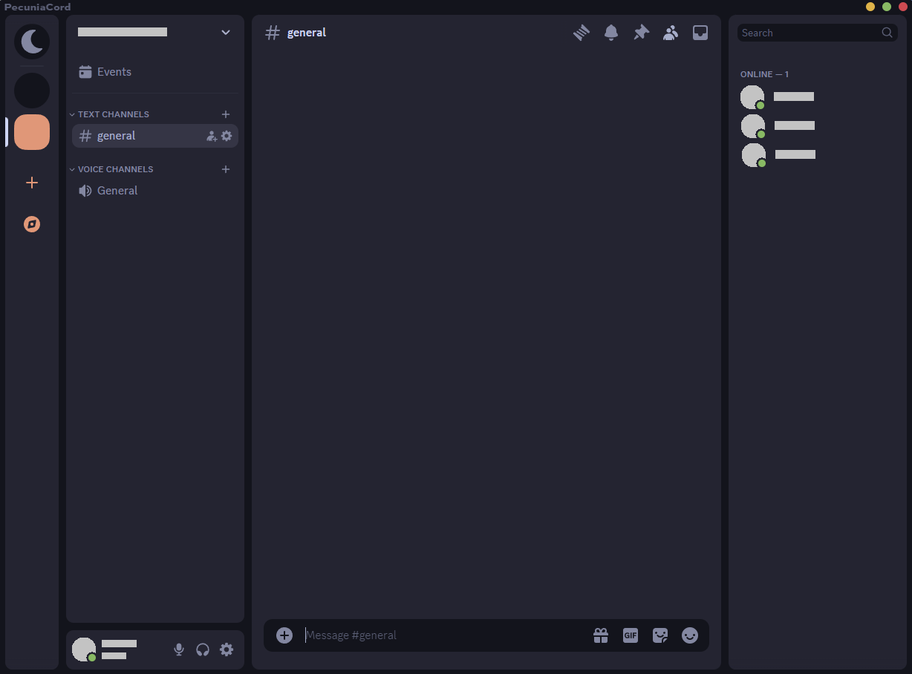

# midnight-orange

a darkened discord theme with rounded chat and sidebars. An orange flavor with slightly warmer colors.

## install

> [!IMPORTANT]  
> make sure to enable dark mode in discord settings for the theme to apply properly! (if you want light mode customize the theme color variables)

#### betterdiscord (or client with local theme folder)

1. download `midnight.theme.css` from <https://betterdiscord.app/theme/midnight> or this repo.
2. put the file into your theme folder. (there should be a button to open the theme folder in theme settings)
3. (optional) customize the theme in `midnight.theme.css`.

#### install through link

add `https://refact0r.github.io/midnight-discord/midnight.css` to your theme import links.

## credits

forked from <https://github.com/refact0r/midnight-discord/>

Based on catppuccin theme (https://github.com/catppuccin/catppuccin)

original design inspired by <https://github.com/schnensch0/zelk>
